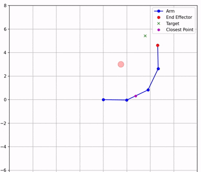
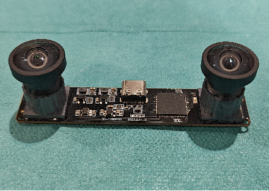

# Integrating Reinforcement Learning and Virtual Fixtures for Safer Automatic Robotic Surgery

**"RL-VF: Reinforcement Learning Framework for Static and Dynamic Obstacle Avoidance in Robotic Surgery"**.


> *Figure 1: Conceptual Diagram of the RL-VF Framework*

  

> *Figure 2: How VF mechanism works and the stereo camera used*


## Repository Structure
The code is divided into three main components:

1. **Vision Module**: Responsible for detecting targets and constraints using computer vision techniques.
   - Includes image rectification, segmentation, stereo matching, and point cloud generation.
   - Outputs a sparse 3D point cloud representing safety constraints (e.g., blood vessels) and target positions (e.g., lymph nodes).

2. **VF Algorithm**: Implements reinforcement learning with virtual fixtures to ensure compliance with hard safety constraints.
   - If you do not have the necessary software and hardware, such as dVRK and the da Vinci robot, you can directly run vf.py to visually understand how the VF mechanism works.

3. **Simulation Environment**: A Unity3D-based simulation environment for training and testing the framework.
   - Includes tasks such as lymph node removal, and human-robot collaboration scenarios.
   - Facilitates Sim-to-Real transfer.

---

## Introduction
The RL-VF framework introduces reinforcement learning with hard safety constraints tailored for robotic manipulator agents. Key features include:
- Integration of static and dynamic obstacle avoidance.
- Applicability in surgical scenarios with constraints modeled by virtual fixtures.
- Comparisons with baseline methods validating improved safety and performance.

---

## Installation
1. Clone the repository:
   ```bash
   git clone https://github.com/fanke-polimi/RL-VF.git

2. The **sim2real** folder contains a ROS package designed for vision perception. Ensure you have ROS installed and configured. This package requires ROS for integration with real robots. Clone the sim2real package into your ROS workspace (e.g., ~/catkin_ws/src):
   ```bash
   cd ~/catkin_ws
   catkin_make
   source devel/setup.bash

3. To use the sim2real package, you need to run the launch file that corresponds to your specific task:
   ```bash
   roslaunch sim2real pcd.grasp.launch
   

4. you can directly run vf.py to visually understand how the VF mechanism works.
   ```bash
   python VF.py

5. To run the Unity3D-based simulation. you need to install unityhub and install unity editor. Then install dVRK:
   ```bash
   https://github.com/jhu-dvrk/sawIntuitiveResearchKit/wiki

6. Then you need to install mlagents or rllib,(mlagents recommanded) to communicate between Unity3D and python;
   ```bash
   https://github.com/Unity-Technologies/ml-agents.git

7. To run unity project, you need to install rossharp or UnityRoboticHub on unity side;
   ```bash
   https://github.com/siemens/ros-sharp

8. On ros side you need to install rosbridge_suite package:
   ```bash
   https://wiki.ros.org/rosbridge_suite

9. Once you have the stereo camera, you need to do the Hand-Eye calibration, we supply the calibration script for dvrk, you can run:
   ```bash
   python hand_eye_cali.py
10. Connect Vision Module with dvrk and unity project.

